<p align="center">
  
</p>

# claude-5h-window-spread

**Stop hitting your 5h cap. Spread your day across more windows.**

For devs who hit Claude Pro/Max cap daily. Get up to 33% more cap from the same plan. No cloud. No credentials. One install.

```bash
/plugin install claude-5h-window-spread@dpt-plugins
/window-spread setup
```

---

## The problem

**17:20 on a Tuesday.** 40 minutes before quitting time. You're mid-debug, one fix from done. Cap hits. Locked out. Can't ship the change, can't finish the thread, can't even reply to your colleague's question.

Window resets at 19:00. By then you're at dinner. Tomorrow you'll start over.

Claude Pro/Max gives you a 5-hour rolling window from your first message. **One window.** Cap typically lands ~40 minutes before the window expires when you're working hard. If your afternoon window started at 12:20, it dies at 17:20 — just before you stop. The last hour of your day evaporates.

| Time  | What happens                                                          |
| ----- | --------------------------------------------------------------------- |
| 08:30 | Morning message. W1 opens 8:30-13:30.                                 |
| 12:20 | Lunch. W1 expires by 13:30 — already past lunch boundary.             |
| 13:00 | Back at desk. W2 opens whenever you send the first afternoon message. |
| 17:20 | **Cap hit. Locked out.** 40 min of dense afternoon debug ruined.      |
| 18:00 | You walk away. Last hour of progress: lost.                           |
| 19:00 | W2 finally resets. You're not at the keyboard.                        |

This is the heavy-use dev day on Pro/Max. The lockouts always seem to land at the worst time.

---

## The fix

Send 4 silent pings throughout the day. Each one anchors a fresh 5h window.

### Without plugin — 3 windows, each absorbs an entire work block

```mermaid
gantt
    title One workday — natural usage
    dateFormat HH:mm
    axisFormat %H:%M

    section Work
    Block 1 (3h50)   :work1, 08:30, 230m
    Block 2 (4h)     :work2, 14:00, 240m
    Evening (3h)     :work3, 20:00, 180m

    section Windows
    W1 — 4h crammed  :crit, w1, 08:30, 300m
    W2 — 4h crammed  :crit, w2, 14:00, 300m
    W3 — 3h evening  :w3,   20:00, 300m
```



Each window gets a full block. W1 and W2 are at HIGH cap risk — 4h of dense work compressed into one 5h window each.

### With claude-5h-window-spread — 4 windows, work splits across them

```mermaid
gantt
    title One workday — with claude-5h-window-spread
    dateFormat HH:mm
    axisFormat %H:%M

    section Work
    Block 1 (3h50)   :work1, 08:30, 230m
    Block 2 (4h)     :work2, 14:00, 240m
    Evening (3h)     :work3, 20:00, 180m

    section Windows
    W1 — 2h30 work   :done, w1, 06:00, 300m
    W2 — 3h20 work   :done, w2, 11:00, 300m
    W3 — 3h work     :done, w3, 16:00, 300m
    W4 — 2h evening  :done, w4, 21:00, 300m
```



Block 1 splits at 11:00 (W1 → W2). Block 2 splits at 16:00 (W2 → W3). Evening splits at 21:00 (W3 → W4). **No window ever absorbs an entire work block. Up to 33% more effective cap.**

---

## Install

```
/plugin marketplace add Digital-Process-Tools/claude-marketplace
/plugin install claude-5h-window-spread@dpt-plugins
```

That's it. Required scheduler ([`claude-code-scheduler`](https://github.com/jshchnz/claude-code-scheduler) by jshchnz) auto-installs as a plugin dependency.

Works on macOS, Linux, Windows. Uses local cron — no cloud, no API keys, no auth dance.

---

## Usage

### Setup your schedule

```
/window-spread setup
```

The skill asks your work pattern in plain language:

```
Skill:  What time do you start work?
You:    8h30
Skill:  Lunch break?
You:    12h20 to 14h
Skill:  When do you stop?
You:    18h, then evening session 20-23
Skill:  Weekdays only?
You:    yes

Optimal: 4 pings at 6 / 11 / 16 / 21
Max work per window: 3h20 (vs 4h natural)
Apply?
```

Confirm. Done. Pings install via launchd / cron / Task Scheduler.

### Check your usage

```
/window-spread status
```

```
Last 30 days
─────────────
Avg windows/day: 3.4
Avg utilization: 71%
Cap hits: 5
Suggested: shift evening ping from 21 to 20:30
```

### Re-tune

```
/window-spread suggest
```

Re-analyses your transcripts. Proposes tweaks. One-command apply.

---

## How it works

Claude Pro/Max windows are **5 hours from your first message**. They reset only when expired.

The math:

1. You can have at most **24 / 5 ≈ 4-5 windows per day**
2. Each window has its own cap (messages + tokens)
3. The longer you cram into one window, the higher cap-hit risk

The algorithm:

1. Take your work blocks
2. Enumerate ping schedules with 1-5 pings, every consecutive pair ≥5h apart (Anthropic's window-reset rule). Windows can have gaps — your laptop just sits idle between blocks.
3. Validate each block is fully covered by either a single window or a contiguous run of windows
4. Pick the schedule that minimizes max work-hours per window, then fewest pings, then prefers round hours (HH:00)

The result: pings placed wherever they help most, possibly with idle gaps. Each work block split as evenly as the 5h granularity allows.

For someone with two shifts (5-10am + 6-10pm), this produces something like `02:30 / 07:30 / 15:00 / 20:00` — gap from 12:30 to 15:00 is dead time, and that's fine.

---

## Compared to alternatives

| Tool                                    | Local           | Cross-platform | Multi-window spread | Analytics |
| --------------------------------------- | --------------- | -------------- | ------------------- | --------- |
| **claude-5h-window-spread**             | ✅              | ✅             | ✅ (4-window math)  | ✅        |
| `vdsmon/claude-warmup`                  | ❌ (GH Actions) | ✅             | ❌ (single ping)    | ❌        |
| `nomadictuba2005/claude-session-keeper` | ✅              | ✅             | ❌ (5h interval)    | ❌        |
| Anthropic Routines                      | ❌ (cloud)      | ✅             | ❌                  | ❌        |
| Anthropic Desktop Tasks                 | ✅              | ❌ (no Linux)  | ❌                  | ❌        |

---

## What it doesn't do

- Doesn't reduce token usage. Cap is the same per window — you just have more windows.
- Doesn't bypass any limit. Uses the windows exactly as designed.
- Doesn't run when your machine is asleep. Local cron requires the laptop awake.

---

## Not for you if

- You never hit the 5h cap
- You only use Claude Code casually (a few messages a day)
- You can't keep your machine awake during your work hours

For everyone else who's been locked out at 11am — keep reading.

---

## Credits

Built on top of [`jshchnz/claude-code-scheduler`](https://github.com/jshchnz/claude-code-scheduler) — generic cross-platform scheduler for `claude -p`. Hat tip to [vdsmon/claude-warmup](https://github.com/vdsmon/claude-warmup) for the original "warmup" idea.

## Development

Pure stdlib Python. No build step, no deps, no virtualenv required.

### Run tests

```bash
python3 -m unittest tests.test_window_spread
```

42 tests cover time parsing, block parsing, simulation math, the optimization algorithm, the natural baseline, and the `compute` subcommand end-to-end.

### Pre-push hook

A pre-push hook at `.githooks/pre-push` runs the full test suite before any push. Enable once per clone:

```bash
git config core.hooksPath .githooks
```

Failed tests block the push. Bypass with `git push --no-verify` (discouraged).

### Manual run

```bash
python3 scripts/window-spread.py compute --blocks "8:30-12:20,14:00-18:00,20:00-23:00"
```

Outputs JSON. Pipe to `jq` for pretty-printing or to `python3 scripts/window-spread.py install -` to apply via claude-code-scheduler.

## License

Source-available. Commercial redistribution prohibited. See [LICENSE](LICENSE).

Built by [Digital Process Tools](https://github.com/Digital-Process-Tools) in Toulouse, France.

---

> "I hit my limit on a Tuesday afternoon, mid-debug. If this plugin had been installed, the lockout wouldn't have happened. So I built it."
